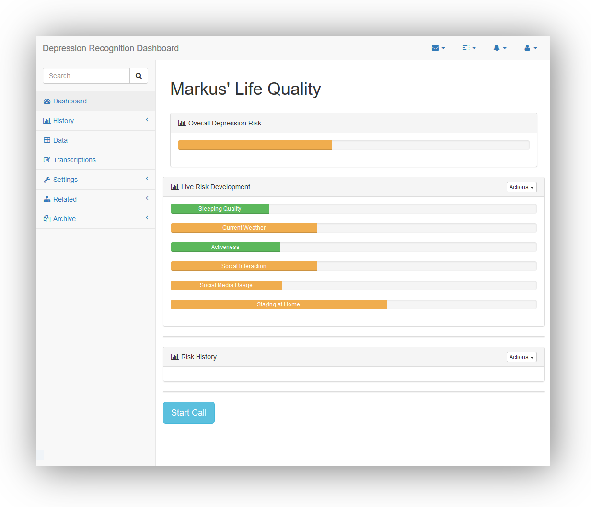

# depression_detector

## Inspiration

Research findings suggest that mobile phone data, such as location, usage, communication patterns, etc. can predict the likelihood of the outbreak of a depression [1, 2]. Depression is a major illness in modern society causing massive social and individual problems. Early detection and intervention can improve the wellbeing of affected individuals dramatically.

[1] [Saeb et al: Mobile Phone Sensor Correlates of Depressive Symptom Severity
in Daily-Life Behavior: An Exploratory Study, 2015, JMIR](http://www.jmir.org/article/viewFile/jmir_v17i7e175/2)

[2] [Doryab et al: Detection of behavior change in people with depression, 2014, AAAI](http://repository.cmu.edu/cgi/viewcontent.cgi?article=1272&context=hcii)

## What it does

Our system learns parameters from a beginning data set of mobile data. From there it will predict a probability score for a person's depression depending on their current data (for example of the last week/ last day). If the probability score exceeds a threshold value, e.g. 0.7, the user will get an automated phone call of our help hotline.

This phone call will evaluate the status of the person, by conducting a short depression test. If the test is positive, i.e. the individual shows strong symptoms of a depression, the user will be forwarded to a professional therapist. If the test is negative nothing happens. In both cases the new labeled data point will be added to the training set of our model. Thus, the model will improve its accuracy, the more users there are.

## Get Started

To get 3rd party frontend components use the common

        bower install

The twilio call server also needs some dependencies

        npm install

Then simply use `node index.js` and open the `index.html`. You're ready to go!
